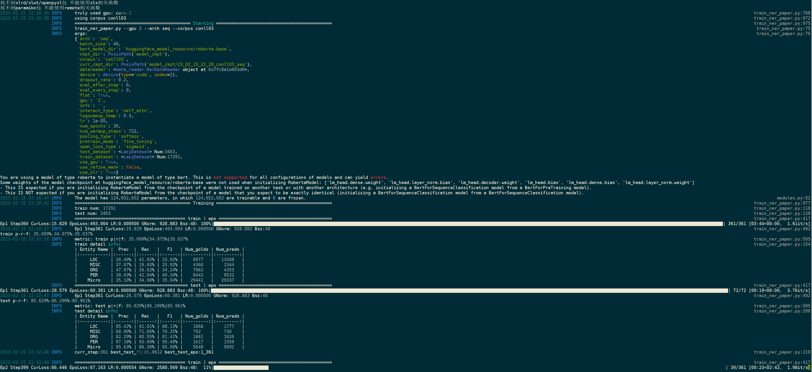

## Introduce

### This is a torch based NER framework which is developed personal nearly started from 2021/1. I have attempted and added lots of plug-in modules/functions experimentally during development to support my research. Now I release the code and welcome to communicate! :).

#### Requirement

```
transformers>=4.3.3
torch>=1.6
tqdm
rich
prettytable
```

#### External resources
e.g., huggingface pretrained models (such as `roberta-base`, `bert-large-cased` etc.) are needed, which should be placed in the `huggingface_model_resource` DIR.

#### Dataset

6 datasets is stored in `data` DIR and have been already preprocessed for NER.

Note: Due to copyright requirements, we claim all these datasets is only for the reproduction purpose and not allowed to transfer in any case.

#### Training

Execute the command such as below:

```shell
python train_ner.py \
	--gpu 0 \
	--info custom_info \
	--corpus conll03 \
	--arch seq
	
# gpu: run in which gpu
# info: custom information to differentiate each run.
# corpus: onto/conll03/ace04/ace05/genia/cluener
# arch: 
#   span: span based model
#   seq: sequence based model
```
running preview:



### Some Reference Projects:
- DSNER
- eznlp

